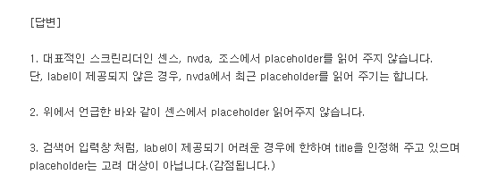

[Date: 19.08.02]

# Input and Select (+label)

### 커스텀 셀렉트를 a요소로 사용
* 현재 셀렉트의 상태를 알 수 있도록 title 속성 값 추가
  ```
  <a href="#" title="언어 하위메뉴 닫힘 상태">한국어</a>
  ```
<br>

### 키보드로 화면 제어 시 숨겨진 input 요소에 영역이 가는 문제 && label 요소에 포커스가 잡히지 않는 문제
* 해당 input 요소에 포커스가 되면, label에 tabindex="0"을 추가하고 포커스가 가게끔 개발쪽에서 수정 요청

<br>

### 스크린 리더기에서 input 요소의 placeholer 속성과 title 속성을 읽어줄까?
* placeholder 속성은 스크린리더기가 읽어주지 않으므로 접근성에 어긋남
<br><br>
[ 참고 ]<br> 
+ 웹접근성 연구소에서 질문자에게 달아준 답변<br>
  
+ [2018년도에 올라온 블로그 글](https://ibrahimovic.tistory.com/30)

​​​
<br><br>

## placeholder를 사용하지 않고, 스크린리더기가 읽어줄 수 있는 방법

### 1. title 속성
보통 사용자가 입력해야되는게 무엇인지 시각적으로 보여져야하는게 접근성에 맞지만, 가끔 디자이너 분들이 안보이게 주는 경우에 사용

**이 경우는 타이틀 label 보다는 title 속성값이 더 좋을 것 같다고 생각**

**그렇게 생각하는 이유는?** <br>
입력창에 마우스를 올리면 그 내용이 떠서 시각적으로 확인이 가능하기 때문<br>
(전 그렇게 생각합니다.)

### 2. label 요소
시각적으로도 보여줘야할 경우에 사용

**단점**<br>
일부 브라우저에서 제대로 보여지지 않기 때문에 js 필요
​

**[ 추가 ]**<br>
보통 input 요소는 label 요소와 짝을 지어 사용하게 되는데, 가끔 label을 사용하기 싫다, 하시는 분들은 label 대신 title 속성값을 꼭 넣어주셔야 접근성에 어긋나지않음

​

**[ 참고 ]**
* [모두를 위한 접근성(글쓴이: 조은, Eun Cho)](https://medium.com/@euncho/%EB%AA%A8%EB%91%90%EB%A5%BC-%EC%9C%84%ED%95%9C-%EC%A0%91%EA%B7%BC%EC%84%B1-cd2045b70f02)
* [접근성 관련 세미나(19.08.03 | 이벤트 종료)](https://festa.io/events/400?source=post_page---------------------------)